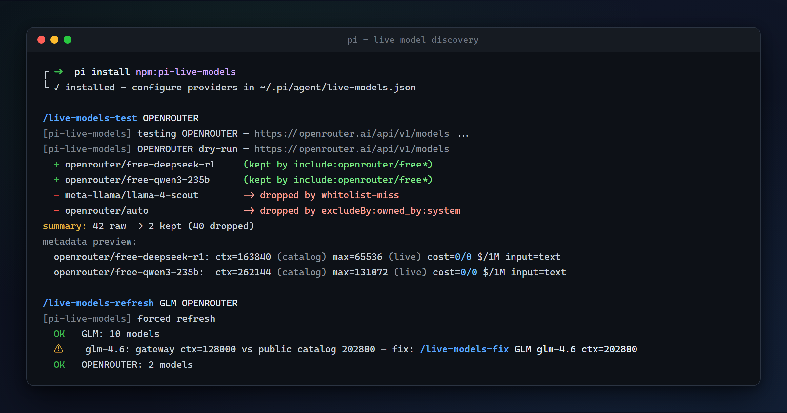

# pi-live-models

[](https://www.npmjs.com/package/pi-live-models)
[](LICENSE)
[](https://github.com/earendil-works/pi)
[](https://github.com/wait4xx/pi-live-models/actions/workflows/ci.yml)

**English** · [简体中文](README.zh-CN.md)

<p align="center">
  
</p>

Live `/v1/models` discovery for [pi](https://github.com/earendil-works/pi) — make every provider's model list reflect what the endpoint **actually serves**, refreshed every time you open `/model`.

Works with **any** OpenAI-compatible or Anthropic-protocol gateway (OpenRouter, relay services, vLLM, LiteLLM, LM Studio, cloud vendors, …), **and** overrides the static catalogs of pi's **built-in** providers — `registerProvider()` with the same id layers on top of the composed base, and a non-empty live list fully replaces it.

## Contents

- [Why](#why)
- [Highlights](#highlights)
- [Install](#install)
- [Quick start](#quick-start)
- [Configuration reference](#configuration-reference)
  - [Filters](#filters)
  - [Presets](#presets)
  - [Auth chain](#auth-chain-discovery-request)
  - [Public metadata catalog](#public-metadata-catalog)
  - [Metadata merge ladder](#metadata-merge-ladder-low--high)
- [Commands](#commands)
- [Offline cache & failure behavior](#offline-cache--failure-behavior)
- [Recipes](#recipes)
- [Safety notes](#safety-notes)
- [Development](#development)
- [License](#license)

## Why

| Pain | With pi-live-models |
|---|---|
| Custom providers in `models.json` are static — new models appear only after hand-editing the file | The list refreshes from `GET /v1/models` every time you open `/model` |
| Built-in provider catalogs go stale between pi releases | Same-id `registerProvider` overrides the built-in catalog with live truth |
| Gateway lists drift (models added, retired, renamed) | Your `/model` picker always mirrors the endpoint — filters decide what you see |

One config file, zero code, zero runtime dependencies.

## Highlights

- 🚫 **Zero filtering by default** — the extension has no opinions about which models are "good". Every filter is yours: glob (`*audio*`), regex (`^glm-4\.`), field-level rules (`includeBy`/`excludeBy` on dotted paths into the live item, e.g. `owned_by`, `architecture.input_modalities`), and reusable **presets**. Exclude always wins; a non-empty include set acts as a whitelist.
- 🔍 **Filter observability** — `/live-models` shows `raw -> kept` statistics; `/live-models-test <provider>` dry-runs discovery and annotates **every** model with its keep/drop reason; `/live-models-refresh [ids...]` forces an immediate refresh bypassing `refreshIntervalMs`.
- 🔑 **Credential reuse** — discovery reuses the key you already have: `/login` stored credential → entry `apiKey` (`$ENV` / `${ENV}` / `!command` / literal) → `models.json` → `<PROVIDER>_API_KEY` env. Keys never appear in logs or errors.
- 🪜 **Metadata merge ladder** — `defaults` < static definitions (`models.json` + `models-store.json`, by id) < live endpoint hints (`context_length`, `max_completion_tokens`, OpenRouter `top_provider.*` and `pricing.*` cost) < **public catalog** (LiteLLM data, exact match only) < `overrides[id]`. New models get sane fallbacks instead of blank metadata. `mergeStatic: "union"` can additionally register static-only models the gateway forgot to list.
- 🌐 **Public metadata catalog** — relays often misreport metadata (`context_length: 128000` stamped on every model). Two community catalogs (LiteLLM + Models.dev) cross-check the gateway: exact-name matches correct `contextWindow`/`maxTokens`, implausible live values are rejected by sanity windows, and suspicious patterns (≥4× divergence from the catalog, uniform placeholder values) are surfaced with a ready-made `/live-models-fix` hint. Cache-backed, background-refreshed, one flag to disable per provider.
- 🛡️ **Never empties your catalog** — a refresh that yields 0 usable models throws and pi keeps the previous list; network failures fall back to a persisted last-good cache (raw items re-filtered and re-merged with your *current* rules), so a gateway outage never blanks `/model` after a restart.
- 📦 Zero runtime dependencies · TypeScript · unit-tested · CI on Windows + Ubuntu.

## Install

```bash
pi install npm:pi-live-models
# or from git:
pi install git:github.com/wait4xx/pi-live-models
```

Then create `~/.pi/agent/live-models.json` (see below) and restart pi. Already have providers in `models.json`? Run `/live-models-init` in pi — it writes a stub entry for every `models.json` provider (idempotent, existing entries untouched), or just declare ids and let them inherit (below).

## Quick start

```jsonc
// ~/.pi/agent/live-models.json
{
  "providers": {
    "MYGATEWAY": {
      "baseUrl": "https://gw.example.com",
      "api": "openai-completions",
      "apiKey": "$MYGATEWAY_API_KEY",
      "filters": { "exclude": ["*embedding*", "*rerank*"] }
    }
  }
}
```

Open `/model` in pi — the list now mirrors `GET https://gw.example.com/v1/models`, minus your excluded patterns. Check status with `/live-models`, tune filters with `/live-models-test MYGATEWAY`.

An entry may omit `baseUrl` to inherit it from the same-id provider in `models.json` (credentials already resolve from `models.json`):

```jsonc
{ "providers": { "MYGATEWAY": { "filters": { "exclude": ["*embedding*"] } } } }
```

## Configuration reference

File: `~/.pi/agent/live-models.json` (respects `$PI_CODING_AGENT_DIR`). Validation is field-precise with graceful degradation: an invalid field is warned and ignored; only entries without a usable `baseUrl` — explicit or inherited from the same-id `models.json` provider — are skipped. Config typos never crash pi startup.

**Top level**

| Field | Type | Description |
|---|---|---|
| `presets` | object | Named reusable filter specs, e.g. `"chat-only": { "excludeRegex": ["-embedding$"] }`. Referenced via `filters.use` / `defaultFilters.use`; flattened (unioned per field) during parsing. See [Presets](#presets). |
| `defaultFilters` | object | Global filters — **blacklists only** (`exclude`, `excludeRegex`, `excludeBy`), unioned with every provider's excludes. A global whitelist is intentionally not offered: include-style fields (written directly or contributed by a preset) are warned + ignored. |
| `providers` | object | Map of provider id → entry. The id must match the provider you want to register/override (the `models.json` key or a built-in provider id). |

**Provider entry**

| Field | Required | Description |
|---|---|---|
| `baseUrl` | ✅* | API root. Models endpoint is derived: ends with a version segment (`/v1`, `/v2`, …) → `{base}/models`, otherwise → `{base}/v1/models`. *May be omitted to inherit from the same-id `models.json` provider; a value that is present but invalid is never inherited.* |
| `modelsUrl` | — | Explicit models-endpoint override when the derivation rule does not fit. |
| `api` | — | `openai-completions` / `openai-responses` / `anthropic-messages`. Can be omitted when overriding a built-in provider (the definition is inherited). |
| `name` | — | Display name. |
| `apiKey` | — | Credential for the discovery request: `"$ENV"`, `"${ENV}"`, `"!shell command"`, or literal. See [Auth chain](#auth-chain-discovery-request). |
| `headers` | — | Extra request headers for the discovery request. |
| `timeoutMs` | — | Discovery fetch timeout, default `10000`. |
| `refreshIntervalMs` | — | Throttle real fetches to at most one per interval. `0` (default) = fetch on every `/model` open. |
| `compat` | — | Provider-level compat fallback for models without one (e.g. `{"thinkingFormat":"qwen"}`). |
| `filters` | — | See [Filters](#filters). |
| `costFromLive` | — | Live pricing fill strategy (OpenRouter-style `pricing.*`, $/token → $/1M): `"fill-zero"` (default) / `"always"` / `"off"`. Details in the [merge ladder](#metadata-merge-ladder-low--high). |
| `catalog` | — | `true` (default) / `false` — opt out of the public metadata catalog for this provider. See [Public metadata catalog](#public-metadata-catalog). |
| `mergeStatic` | — | `"live"` (default) or `"union"` — also register static-only models from `models.json`/`models-store.json`. |
| `defaults` | — | Metadata fallback for all models: `reasoning`, `input`, `contextWindow`, `maxTokens`, `cost`. |
| `overrides` | — | Per-model-id metadata overrides: `{"qwen3.8-max":{"contextWindow":1000000}}`. |

### Filters

```jsonc
"filters": {
  "include":      ["*glm*"],            // glob whitelist on id, case-insensitive
  "exclude":      ["*audio*", "*tts*"], // glob blacklist on id
  "includeRegex": ["^glm-[\\d.]"],      // regex whitelist on id, case-sensitive
  "excludeRegex": ["^gpt-5\\.6$"],
  "includeBy":    { "owned_by": ["openai"] },                     // field whitelist (AND across fields)
  "excludeBy":    { "architecture.input_modalities": ["*image*"] }, // field blacklist (OR)
  "use":          ["chat-only"]         // preset references, see below
}
```

Semantics (pinned by unit tests):

| Rule | Behavior |
|---|---|
| Nothing configured | **Every model passes.** Zero filtering is the default. |
| `exclude` / `excludeRegex` / `excludeBy` | A match on any exclude rule (entry-level **or** global `defaultFilters`, unioned) drops the model. |
| Exclude precedence | Exclude always wins — an excluded model cannot be rescued by any include rule. |
| Whitelist | If any include rule exists, a model must satisfy all of them: match ≥1 id pattern (`include`/`includeRegex`, unioned) **and** hit every `includeBy` field (AND). |
| Field rules (`*By`) | Dotted paths into the live `/v1/models` item. String values match case-insensitive globs; array values match if **any** element hits; missing fields / non-string values never match excludes and always fail includes (`includeBy-miss:<field>`). v0.2 is string-glob only — no numeric ranges. |
| Case | Globs case-insensitive; regexes case-sensitive (use `(?i)` if needed). |
| Invalid regex | Reported at startup with its config location, then ignored — never breaks the config. |
| Everything filtered out | The refresh throws (pi keeps the previous catalog) and the error names the rules responsible. |

### Presets

Define once at the top level, reuse everywhere (`filters.use`, `defaultFilters.use`). Preset lists are **unioned** with the spec's own lists during parsing; a preset referenced by `defaultFilters` contributes blacklists only:

```jsonc
{
  "presets": {
    "chat-only": { "excludeRegex": ["-embedding$", "-rerank$", "-tts$", "-realtime$"] },
    "no-legacy": { "excludeRegex": ["^glm-4\\."] }
  },
  "providers": {
    "GLM": {
      "baseUrl": "https://gw.example.com",
      "filters": { "use": ["no-legacy"], "include": ["*glm*"] }
    }
  }
}
```

Presets cannot reference other presets; unknown preset names are warned + ignored — same graceful degradation as every other config field.

### Auth chain (discovery request)

1. `/login` stored credential (pi passes it in the refresh context)
2. entry `apiKey` spec — `$ENV` / `${ENV}` / `!command` / literal
3. `~/.pi/agent/models.json` → `providers[id].apiKey` (same spec syntax)
4. env `<PROVIDER_ID>` upper-cased, non-alnum → `_`, suffixed `_API_KEY`

⚠️ The `!command` form executes a shell command — only use it if you understand what it runs. Keys never appear in logs or errors; the cache file stores model metadata only, never credentials.

### Public metadata catalog

Many relay gateways stamp every model with the same `context_length` (usually `128000`), or omit metadata entirely. The public catalog is an independent cross-check built from **two community-maintained sources**: LiteLLM's [`model_prices_and_context_window.json`](https://github.com/BerriAI/litellm/blob/main/model_prices_and_context_window.json) (~2500 chat models) and [Models.dev](https://models.dev)'s [`api.json`](https://models.dev/api.json) (~7300 entries from 200+ providers, indexed from official documentation — fast coverage of new releases).

**How it works**

- **Sources**: two independent catalogs, each with its own fetch path, disk cache, staleness clock and failure backoff — one source being down never affects the other. LiteLLM is fetched via jsDelivr CDN with a raw.githubusercontent.com fallback; Models.dev is a single CDN URL. Both are fetched in the background, never blocking discovery. On failure, discovery proceeds without the catalogs and retries after a 30-minute backoff.
- **Cache**: `~/.pi/agent/live-models-catalog.json` (LiteLLM) and `~/.pi/agent/live-models-catalog-modelsdev.json` (Models.dev), each refreshed in the background after 7 days. `/live-models-catalog-refresh` forces a refetch of both (a partial failure still applies the successful one).
- **Matching**: exact model-name match only — no fuzzy matching, ever. `provider/` prefixes, `:suffix` tags (`:free`, `:latest`) and date suffixes (`gpt-4o-2024-11-20`) are normalized for the lookup; an exact catalog entry always beats a normalized one.
- **Arbitration** (normalized keys only): the same model deployed by several providers routinely carries *deployment-specific* limits, so candidates are arbitrated in tiers — the **vendor's own LiteLLM entry wins** (a two-segment `vendor/model` key whose `litellm_provider` matches, e.g. `zai/glm-4.6`); multiple vendor entries must agree within a 5% tolerance (rounding differences between catalogs are not disagreements — the merged value is the conservative minimum); with no vendor entry, **independent sources must agree** within the same tolerance; **disagreement abstains** — the model falls back to the static/live ladder and a warning shows the top competing values with a `/live-models-fix` hint. A **lone third-party deployment** is silently skipped as unverified. Models.dev entries never claim vendor status: its 200+ namespaces include many resellers listing the same bare ids as the vendor's own (`vancine/glm-5.3-flash` vs `zai/glm-5.3-flash`) and nothing in the data distinguishes them — so Models.dev contributes consensus/divergence signals and new-model coverage, never unvetted authority. `/live-models-catalog` shows both sources and the arbitration totals.
- **Scope**: chat-mode entries (entries without a `mode` field are kept); values must pass sanity windows (context 1,024–10,000,000 tokens, max output 128–10,000,000).

**What it changes**

- The ladder gains a layer between live hints and your overrides — a trusted catalog value beats the gateway's claim (see [merge ladder](#metadata-merge-ladder-low--high)).
- **Implausible live values are quarantined**: a live `context_length` of `0`, `100` or `10¹²` no longer poisons metadata — sanity windows reject it before it can win.
- **Suspicious patterns are surfaced** by `/live-models-test` and `/live-models-refresh`:
  - gateway context diverges ≥4× from the catalog (either direction) → warning with a ready-made `/live-models-fix <provider> <model> ctx=<catalog value>` command;
  - ≥3 models sharing one identical live context value → uniform-placeholder warning (classic relay stamp).

Don't want any of this? One field: `"catalog": false` on the provider entry — no catalog lookups, no catalog warnings. (The sanity windows on live values stay on: an implausible `context_length` never wins regardless.)

### Metadata merge ladder (low → high)

`entry.defaults` < static definitions (`models.json` entry + `models-store.json` cache, matched by id) < live endpoint hints (`context_length`, `context_window`, `max_model_len`, `max_completion_tokens`, `max_tokens`, OpenRouter `top_provider.*`) < public catalog (exact match, [see above](#public-metadata-catalog)) < `entry.overrides[id]`

Live values must pass sanity windows before they can win a layer: context integer 1,024–10,000,000 tokens, max output 128–10,000,000. A rejected live value falls through to the next layer instead of propagating. `/live-models-test` annotates the preview with the winning source for each field (`ctx=202800 (catalog)`, `max=… (live)`).

**Cost** follows the same ladder, moderated by `costFromLive`:

| Policy | Behavior |
|---|---|
| `"fill-zero"` (default) | Live `pricing.*` hints (converted $/token → $/1M) fill cost **only when nothing else defines it** — hand-written prices always win. |
| `"always"` | Live pricing beats static/defaults **key by key** — a live entry reporting only `pricing.prompt` keeps static output prices. `overrides[id].cost` still wins on every key. |
| `"off"` | Live pricing ignored entirely. |

Explicit `"0"` (free tier) is a valid live cost; strict decimal strings only.

`mergeStatic: "union"` additionally registers models that exist in `models.json`/`models-store.json` but are missing from the gateway's live list (same filters apply, static def acts as the field source for `*By` rules). A zero-model **live** result still throws — union supplements, never papers over a broken gateway.

Live-only models fall back to `defaults`, then to pi-safe values (`reasoning: true`, `input: ["text"]`, `contextWindow: 128000`, `maxTokens: 32768`, zero cost).

## Commands

| Command | Purpose |
|---|---|
| `/live-models` | Configured providers, models endpoint, filter summary, last discovery result (`raw -> kept` statistics). |
| `/live-models-reload` | Re-read the config file and re-register immediately (no restart). |
| `/live-models-init` | Bootstrap `live-models.json`: write a `{ baseUrl }` stub for every `models.json` provider not yet configured (idempotent, existing entries untouched, broken config files are never clobbered), then re-register immediately. |
| `/live-models-test <provider>` | Dry-run one discovery: per-model `kept by …` / `dropped by …` annotation plus a metadata preview (context window, cost, input types). |
| `/live-models-refresh [ids...]` | Force an immediate live refresh, bypassing `refreshIntervalMs` (no argument = all providers). Updates the in-memory catalog and the persisted cache; failures are shown verbatim (no cache fallback for manual actions). |
| `/live-models-catalog` | Show public-catalog status: both sources (entries, fetch time), merged count, arbitration totals, cache paths. |
| `/live-models-catalog-refresh` | Force a blocking refetch of the public metadata catalog. |
| `/live-models-fix <provider> <model> ctx=<n> [max=<n>]` | Write a metadata correction into `overrides` in `live-models.json` (atomically, preserving the rest of the file), then run `/live-models-reload` to apply. Validates against the sanity windows and the provider's known model ids. |

## Offline cache & failure behavior

| Situation | Behavior |
|---|---|
| Refresh succeeds | Models update; the **raw endpoint items** are persisted to `~/.pi/agent/live-models-cache.json` (format v2). |
| Network / HTTP / JSON failure | Falls back to the last-good cache — rebuilt through the **full pipeline** (current filters, merge ladder, union) from the raw items, so config changes are honored mid-outage. v1 caches (pre-0.2) are still readable and used best-effort (id-only re-filter) until the next successful refresh upgrades them. |
| Filters drop everything (0 models) | Config intent error — the refresh **throws**, pi keeps the previous catalog, and the error names the responsible rules. Never silently serves stale models. |
| Live endpoint returns 0 models | Same as above — `mergeStatic: "union"` is a supplement, not a fallback. |
| Caller aborts (list mode, `/model` closed mid-flight) | Rethrown as-is — no warnings, no cache fallback. |
| Manual `/live-models-refresh` fails | Verbatim error report — manual actions never mask failures with cached data. |
| Catalog fetch fails | Discovery proceeds without it; a background retry happens after a 30-minute backoff (or force it with `/live-models-catalog-refresh`). |

## Recipes

**OpenRouter (free models only):**

```jsonc
"OPENROUTER": {
  "baseUrl": "https://openrouter.ai/api/v1",
  "api": "openai-completions",
  "filters": { "include": ["openrouter/free"] },
  "compat": { "thinkingFormat": "openrouter" }
}
```

**Relay gateway with known-bad legacy line** (drop old `glm-4.*`, audio/realtime variants):

```jsonc
"GLM": {
  "baseUrl": "https://gw.example.com",
  "api": "anthropic-messages",
  "filters": {
    "includeRegex": ["^glm-[\\d.]"],
    "excludeRegex": ["^glm-4\\."]
  }
}
```

**Override a built-in provider's stale catalog:**

```jsonc
"qwen-token-plan-cn": {
  "baseUrl": "https://token-plan.example.com/compatible-mode/v1",
  "api": "openai-completions",
  "exclude": ["qwen-audio-*", "wan*"],
  "compat": { "thinkingFormat": "qwen", "supportsDeveloperRole": false }
}
```

**Gateway list is incomplete** (models defined in `models.json` missing from `/v1/models`):

```jsonc
"GLM": {
  "baseUrl": "https://gw.example.com",
  "api": "anthropic-messages",
  "mergeStatic": "union"   // static-only models are registered too (same filters apply)
}
```

**Let OpenRouter pricing fill the cost fields** instead of hand-writing `overrides`:

```jsonc
"OPENROUTER": {
  "baseUrl": "https://openrouter.ai/api/v1",
  "api": "openai-completions",
  "costFromLive": "always",   // default "fill-zero" only fills models with no cost source
  "filters": { "use": ["chat-only"] }
}
```

**Gateway misreports context windows** (every model stamped `context_length: 128000`): nothing to configure — the public catalog corrects exact matches automatically, and `/live-models-test` flags the mismatches. For a model the catalog doesn't know (or to pin your own value), write an override from the terminal:

```
/live-models-fix GLM glm-4.6 ctx=202800
/live-models-reload
```

## Safety notes

- The extension performs `GET` requests only against URLs **you** configure, plus the two optional public-catalog reads (LiteLLM via jsDelivr/raw.githubusercontent, Models.dev — no query parameters, no credentials); no bundled endpoints, no telemetry.
- The cache files store model metadata only — never credentials.
- Catalog data is community-maintained and matched exactly; it can be wrong or missing, and overrides always take precedence.
- Invalid config fields degrade gracefully (warned and ignored); config typos never crash pi startup.

## Acknowledgments

Model metadata comes from community-maintained catalogs — this project would be much poorer without them:

- **[LiteLLM](https://github.com/BerriAI/litellm)** — the [`model_prices_and_context_window.json`](https://github.com/BerriAI/litellm/blob/main/model_prices_and_context_window.json) catalog: the broadest provider/pricing/metadata dataset in the ecosystem, and the source of the vendor-namespace truth this extension arbitrates on.
- **[Models.dev](https://models.dev)** — the [`api.json`](https://models.dev/api.json) catalog: structured per-provider model specs indexed from official documentation, with remarkably fast coverage of new releases.

Thank you to both teams and their contributors. This extension is an independent consumer and is not affiliated with either project.

## Development

```bash
npm install
npm run typecheck   # tsc --noEmit
npm test            # node:test via tsx (77 tests)
npm run smoke       # register against the real config (no TUI)
npx tsx scripts/smoke.ts GLM   # + one live refreshModels pass for GLM
```

CI: Windows + Ubuntu × Node 22/24.

## License

MIT © wait4xx
